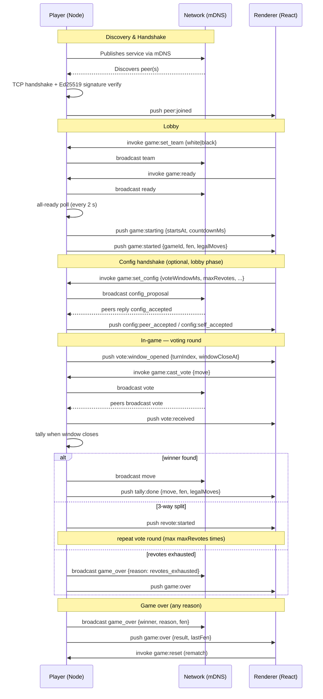

# Game Flow

Full sequence from node boot to game over.

## Game-ending reasons

| Reason | Trigger |
|---|---|
| `checkmate` | Chess engine detects checkmate |
| `stalemate` | Chess engine detects stalemate |
| `resignation` | Resign vote reaches ≥ resignThreshold of connected team |
| `disconnect` | Peer disconnect detected mid-game |
| `draw_agreement` | Both sides accept a draw offer |
| `revotes_exhausted` | No plurality after maxRevotes re-vote rounds |
| `timeout` | No vote cast before MOVE_TIMEOUT_MS (120 s hard cap) |
