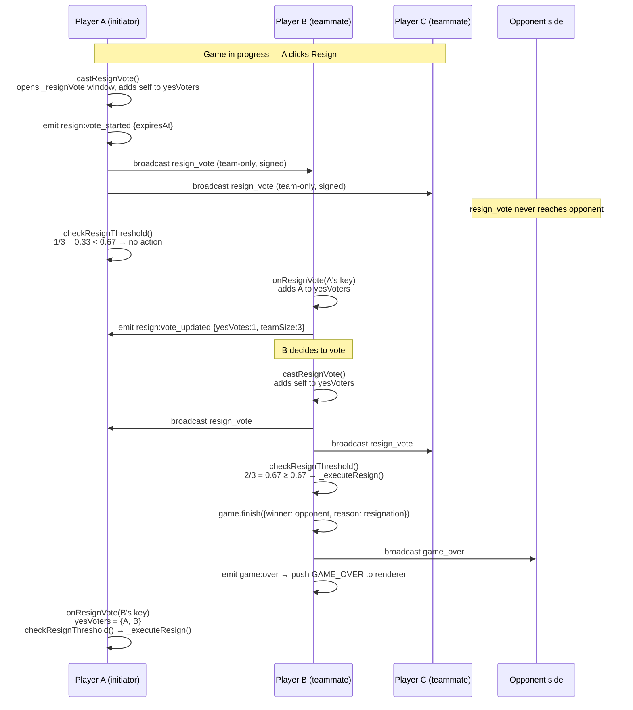
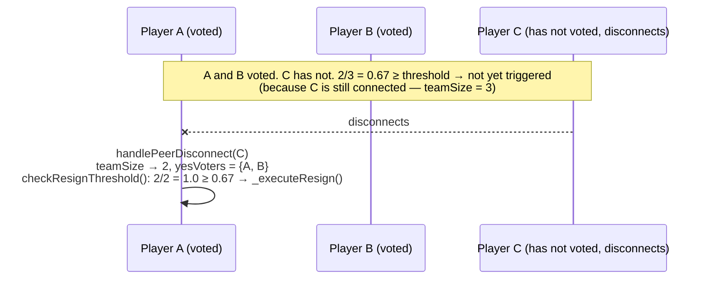
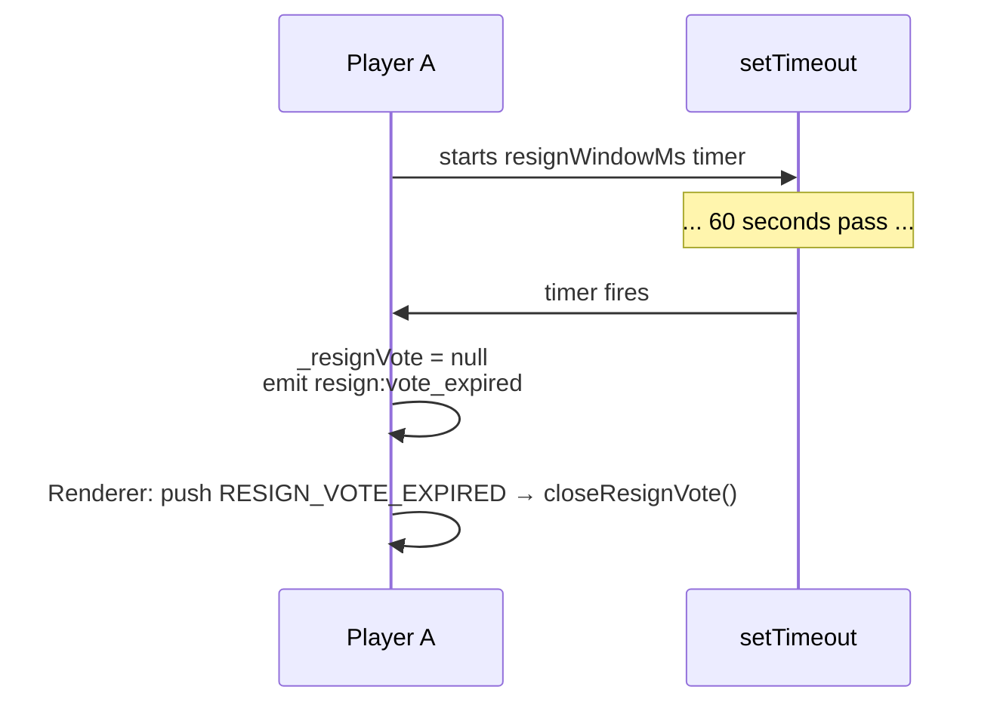

# Resign Vote Protocol

A single player cannot resign unilaterally. A majority of the currently connected teammates must vote yes within the vote window.

## Configuration (set at lobby, via config handshake)

| Key | Default | Meaning |
|---|---|---|
| `resignThreshold` | 0.67 | Fraction of connected team needed (e.g. 0.67 → 2 of 3) |
| `resignWindowMs` | 60 000 ms | Window auto-expires after this with no effect |

## Sequence

## Disconnect handling

When a teammate disconnects mid-vote, `handlePeerDisconnect` calls `checkResignThreshold()`. The denominator shrinks — a vote that was at 1/3 (below threshold) becomes 1/2 or higher and may cross the threshold automatically.

## Expiry

If the window reaches `resignWindowMs` without threshold being met, the timer fires:

## Deduplication rules

- A player's key can only appear in `yesVoters` once, regardless of how many times they click Resign or how many `resign_vote` messages arrive from the network.
- The threshold check uses `connectedTeamSize()` as the denominator — alive peers on the same team + self.
- Votes from disconnected players **remain** in `yesVoters`; only the denominator shrinks.
